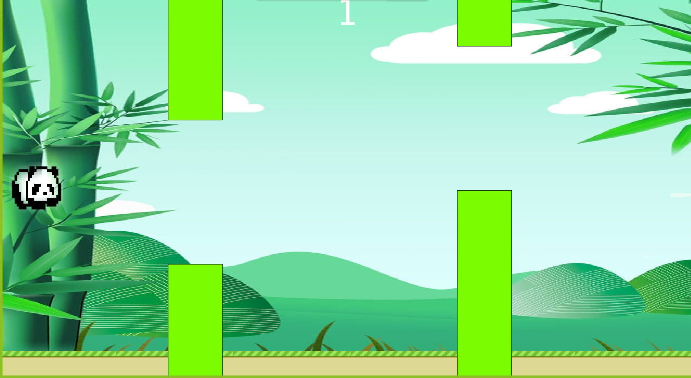

PANDA CROSSING
==============

Este juego consiste en un panda que tiene que ir atravesando diferentes
obstáculos y al llegar a 100 puntos gana el juego, puede decidir si
quiere seguir jugando o salir del juego. Para superar los obstáculos hay
que ir presionando la flecha de arriba y así evitar tocar los palos de
bambú.

* * * * *

###### Imagen del juego en Processing 3\*
