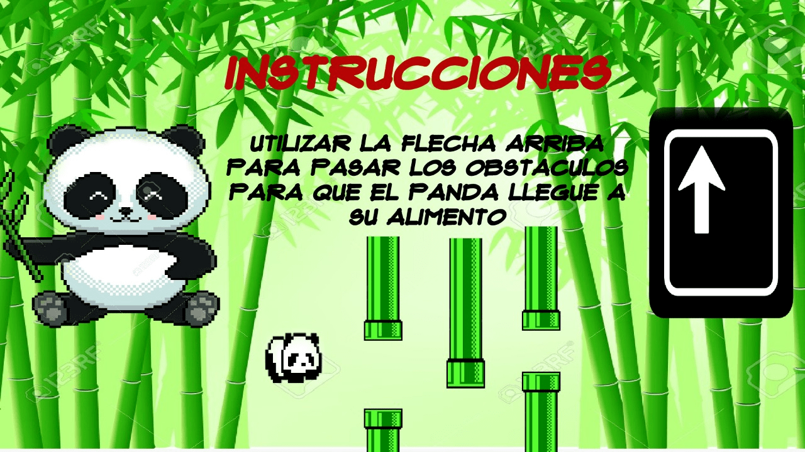
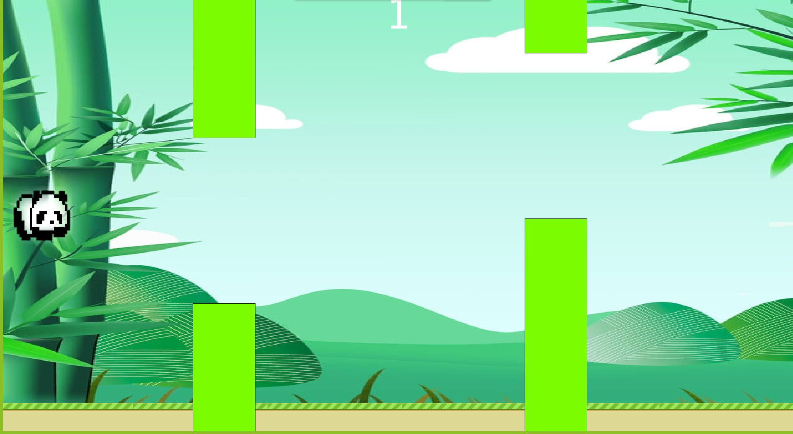

PANDA CROSSING
==============

Este juego consiste en un panda que tiene que ir atravesando obstáculos a medida que va avanzando, para esto el panda salta al hacer uso de la tecla de flecha hacia arriba.
Al llegar a 50 puntos el juego comienza a dificultarse y los palos de bambú comienzan a moverse, al llegar a 100 el juego será completado y habrás ganado, puedes escoger si deseas seguir jugando o quieres salir.

* * * * *

###### Inicio del juego\*

###### Instrucciones del juego\*

###### Imagen del juego corriendo en Processing 3\*

###### Créditos\*
