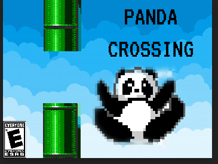
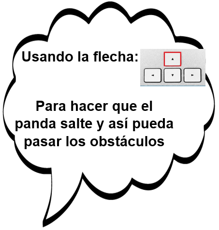

PANDA CROSSING
==============

Panda crossing es un videojuego que consiste en un panda el cual debe atravesar un bosque para llegar a su alimento al estilo de Flappy Bird.
Para esto el jugador debe utilizar la flecha arriba haciendo que el panda salte y atraviese los obstáculos, si llega a chocar con un obstáculo el juego terminará.

*Para este programa debe instalarse la librería "Minim"

## Autores
Jeremy Santiago Poveda Mendoza

Liliam Daniela Rodríguez Morales

## Instrucciones

## Clasificación

## Créditos
Programación y diseño:
Jeremy Poveda y Liliam Rodríguez

Música:
La música es extraída de la banda sonora del juego Final Fantasy VII: “The gret warrior”.

Inspiración:
Juego inspirado en el juego Flappy Bird que comparte sus mismas mecánicas y jugabilidad.

Agradecimientos:
Cristian Sierra y Dayana Navarro por su apoyo, consejos y pruebas en la realización del juego.